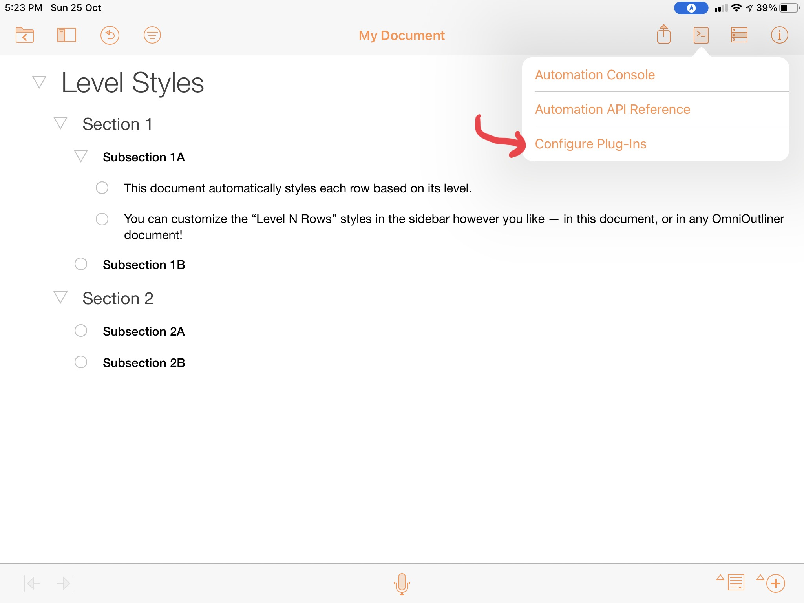
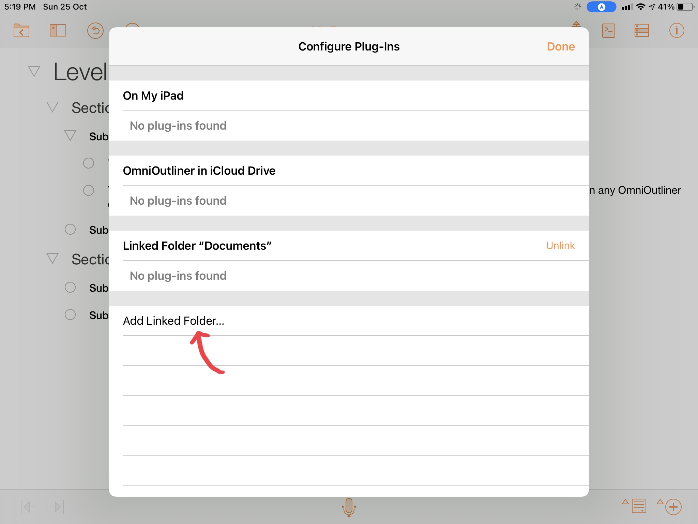
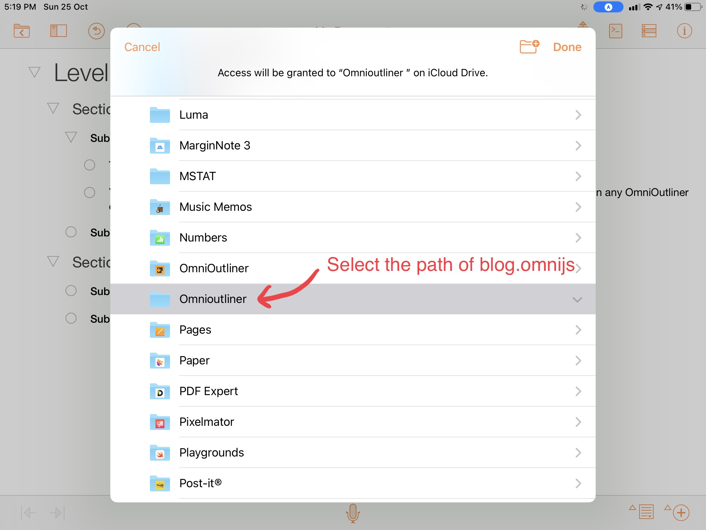
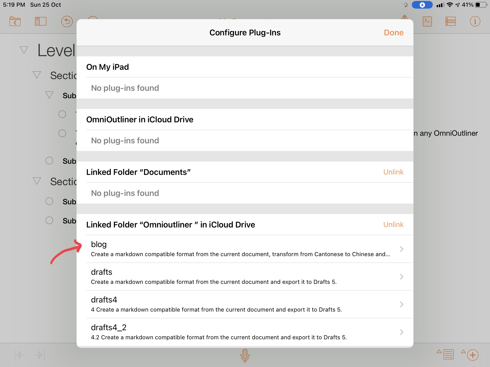
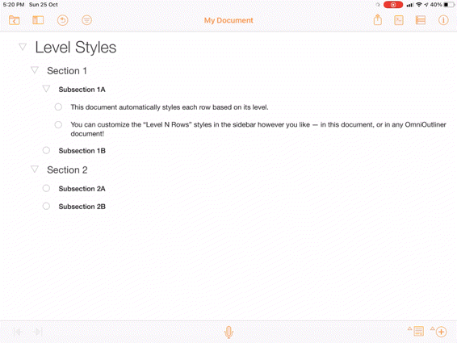

# ios-omnioutliner-to-ulysses

OmniJS and Shortcuts to export text content from OmniOutliner to Ulysses

In iOS environment, this tool helps to convert text content from [OmniOutliner](https://www.omnigroup.com/omnioutliner/) to [Ulysses](https://ulysses.app) in Markdown format, also it will helps to translate Cantonese to Chinese Traditional character.

## How to setup

Before using this tool, please do the following setup:

Step 1: Download and install this iOS shortcuts: [Convert Content from Cantonese to Chinese](https://www.icloud.com/shortcuts/b378136574864b57ac8b61a7debc01ae)

Step 2: Download and install this iOS shortcuts: [Convert Content from Cantonese to Chinese, then copy to clipboard or create new Ulysses Sheet](https://www.icloud.com/shortcuts/d6486c055cf44700be6eb8074f46494b)

Step 3: Copy blog.js to some directory inside iCloud drive

Step 4: Do the following steps inside OmniOutliner document:

Then you should see the script with `blog` appears here.

## How to use this tool

Open OmniOutliner with the document you wants to export to Ulysses, and see below video to follow the steps.

